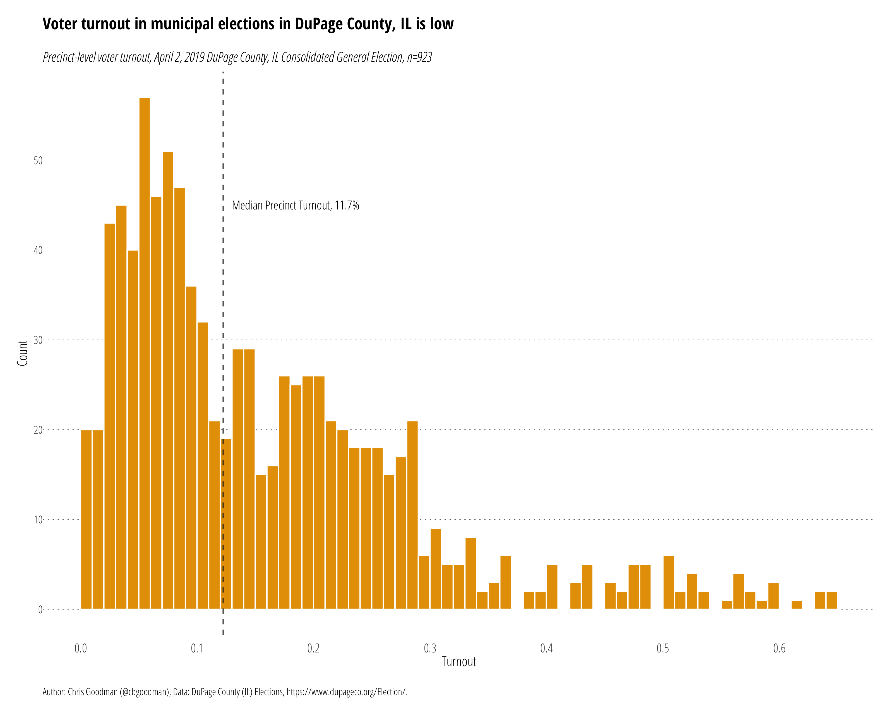

## DuPage County, IL 2019-04-02 Consolidated General Election Turnout

Illinois has consolidated municipal elections (see here [10 ILCS 5/2A-1.2](http://www.ilga.gov/legislation/ilcs/ilcs5.asp?ActID=170&ChapterID=3) for more information on the exact races) in odd years. The below figure shows a histogram of precinct-level turnout numbers for DuPage County, IL for the election of April 2, 2019. For reference, the statewide turnout in the 2018 general election was 51.40 of registered voters. 

Data from the [DuPage County Election Results Reporting](https://www.dupageresults.com/IL/DuPage/94959/Web02.226438/#/) site.
